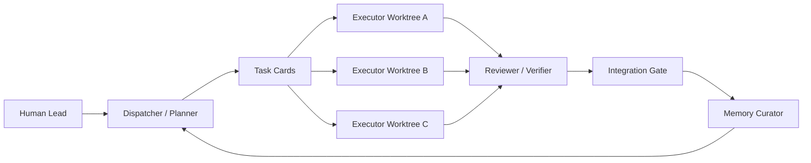

# Production AI Team Workflow

This directory implements a production-oriented AI development team:



## Core Idea

Parallelism happens only in isolated Git worktrees with explicit task boundaries. Quality control stays centralized through review and integration gates.

This avoids the common failure mode of many AI windows: each window has partial context, edits overlapping files, repeats past mistakes, and spends tokens rediscovering the project.

## Daily Workflow

1. Tell Codex the real product or feature request in natural language.
2. Codex routes the request through `AGENTS.md`, then uses Dispatcher to create the fewest useful layered task cards.
3. New products start with product decision and design cards before implementation cards.
4. Executor works from one task card, one branch or worktree, and only the relevant project context.
5. Executor records compact evidence in `.ai-team/state/runs.json`.
6. Reviewer checks diff, verification, command policy, and task evidence before passing work.
7. Integration Gate merges in dependency order and uses Release Gate for deployment or publishing.
8. Memory Curator records only durable pitfalls and reusable patterns.

## Layered Task Cards

Each task card has `task_type` and `delivery_stage` fields so the agent knows what kind of work is allowed:

- `product_decision`: audience, pain, MVP scope, product surface, scale, cost, and approvals.
- `design`: frontend screens, components, states, and user interactions.
- `implementation`: code changes that follow confirmed product and design decisions.
- `verification`: review, testing, security, performance, and release readiness.
- `deployment`: infrastructure, capacity, monitoring, rollback, and release actions.
- `maintenance`: cleanup, migration, documentation, and follow-up improvements.

For user-facing products, implementation should not start until the relevant product decision and frontend design cards are complete or explicitly waived.

## Minimal Commands

Most days in Codex, just say the real request:

```text
我要做一个待办产品，MVP 包含登录、任务列表、部署到 Vercel
```

Codex should route the request through `AGENTS.md` and `.ai-team/`. The scripts are fallback helpers and repeatable audit tools, not the normal user interface.

Create a task card:

```powershell
powershell -NoProfile -ExecutionPolicy Bypass -File .ai-team/scripts/New-AiTeamTask.ps1 -Id login-auth -Title "Implement login auth" -WorkflowMode auto
```

Preview workflow mode:

```powershell
powershell -NoProfile -ExecutionPolicy Bypass -File .ai-team/scripts/Get-AiTeamWorkflowMode.ps1 -Title "Fix README typo" -AllowedFiles "README.md"
```

Record run evidence:

```powershell
powershell -NoProfile -ExecutionPolicy Bypass -File .ai-team/scripts/Update-AiTeamRun.ps1 -TaskId login-auth -Role executor -Status passed -Verification "npm run build: passed"
```

Show current task and run status:

```powershell
powershell -NoProfile -ExecutionPolicy Bypass -File .ai-team/scripts/Get-AiTeamStatus.ps1
```

Classify command risk before unclear or risky commands:

```powershell
powershell -NoProfile -ExecutionPolicy Bypass -File .ai-team/scripts/Test-AiTeamCommand.ps1 -Command "npm install <package>"
```

Print an agent startup bundle:

```powershell
powershell -NoProfile -ExecutionPolicy Bypass -File .ai-team/scripts/Get-AiTeamContext.ps1 -TaskId login-auth
```

Create an isolated worktree:

```powershell
powershell -NoProfile -ExecutionPolicy Bypass -File .ai-team/scripts/New-AiTeamWorktree.ps1 -TaskId login-auth
```

Review a task diff:

```powershell
powershell -NoProfile -ExecutionPolicy Bypass -File .ai-team/scripts/Test-AiTeamTask.ps1 -TaskId login-auth -WorktreePath <path-to-worktree>
```

Generate a structured review report:

```powershell
powershell -NoProfile -ExecutionPolicy Bypass -File .ai-team/scripts/New-AiTeamReviewReport.ps1 -TaskId login-auth -OutFile auto
```

Check task state and evidence requirements:

```powershell
powershell -NoProfile -ExecutionPolicy Bypass -File .ai-team/scripts/Test-AiTeamStateMachine.ps1
```

Measure context budget before loading large memory or run evidence:

```powershell
powershell -NoProfile -ExecutionPolicy Bypass -File .ai-team/scripts/Measure-AiTeamContext.ps1
```

Create a benchmark report for stability, rework, and context/token comparison:

```powershell
powershell -NoProfile -ExecutionPolicy Bypass -File .ai-team/scripts/New-AiTeamBenchmark.ps1 -Id todo-mvp -ProjectName "Todo MVP"
```

## Non-Negotiable Rules

- Small low-risk changes may use `light` workflow mode. Normal product work uses `standard`. Auth, data, payments, dependencies, deployment, security, or production-facing work uses `strict`.
- Parallel execution is a workflow mode, not a default. Use it only when boundaries are clean.

- Default parallelism is 2 to 3 Executor agents. Use 4 only when file boundaries are very clean.
- A task that touches shared data models, common APIs, auth, payment, migrations, or build configuration is serial by default.
- No Executor approves its own work.
- No task is done without a reproducible verification command or an explicit reason why verification is impossible.
- Tasks in `review` need executor evidence. Tasks marked `done` need executor and reviewer evidence.
- Strict tasks marked `done` need integration evidence or an explicit waiver.
- Approval-required commands must follow `.ai-team/policies/command-policy.md`.
- Unknown commands default to approval-required when classified by `.ai-team/scripts/Test-AiTeamCommand.ps1`.
- Deployment, publishing, release tagging, and production-facing actions must pass Release Gate.
- Memory must be compressed and reusable. Full transcripts, raw logs, run ledgers, and one-off observations do not belong in memory.

## Directory Map

- `.ai-team/memory/`: durable project context, pitfalls, and reusable patterns.
- `.ai-team/tasks/`: task cards and task state.
- `.ai-team/metrics/`: benchmark reports and context/token comparison records.
- `.ai-team/prompts/`: role prompts for Dispatcher, Executor, Reviewer, and Memory Curator.
- `.ai-team/checklists/`: plan, review, security, release, and integration gates.
- `.ai-team/policies/command-policy.md`: safe, approval-required, and forbidden command classes.
- `.ai-team/policies/workflow-modes.md`: light, standard, strict, and parallel workflow selection plus token discipline.
- `.ai-team/scripts/Get-AiTeamWorkflowMode.ps1`: conservative workflow mode classifier used by task creation and health checks.
- `.ai-team/scripts/New-AiTeamReviewReport.ps1`: structured review report with boundary, state, evidence, and recommended decision.
- `.ai-team/scripts/Test-AiTeamStateMachine.ps1`: task state and evidence consistency checks.
- `.ai-team/scripts/Measure-AiTeamContext.ps1`: context size and token budget estimate for memory, tasks, repo-map, and runs.
- `.ai-team/scripts/New-AiTeamBenchmark.ps1`: creates a benchmark report to compare baseline AI coding against AI Team Workflow.
- `.ai-team/scripts/Test-AiTeamCommand.ps1`: lightweight command risk classifier.
- `.ai-team/scripts/`: small PowerShell helpers for repeatable operations.
- `.ai-team/hooks/`: reusable hook entrypoints and examples for agent tools.
- `.ai-team/commands.json`: project verification commands used by Reviewer/Verifier.
- `.ai-team/github/`: lightweight issue and PR templates for GitHub-backed projects.
- `.ai-team/index/repo-map.md`: compact codebase map to reduce repeated exploration.
- `.ai-team/state/tasks.json`: tool-readable task state synced from task cards.
- `.ai-team/state/runs.json`: compact run evidence for execution, review, and integration.
