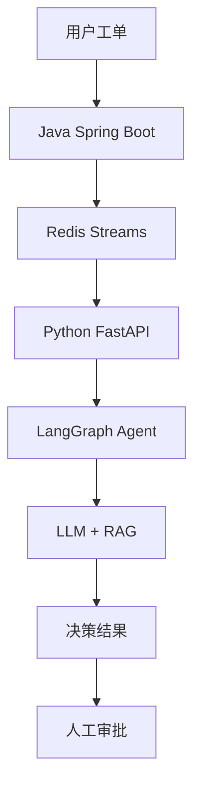

# Task: 阶段 6 展示与简历证据

## Status

- Task ID: `TASK-006`
- Owner: `ai-engineer`
- Task Type: `documentation`
- Delivery Stage: `showcase`
- Status: `pending`
- Mode: `standard`
- Work Mode: `sequential`
- Workflow Mode: `standard`
- Dependencies: TASK-005 (已完成)
- Verification Status: `not_run`
- Last Run:
- Last Result:
- Blocked Reason:
- Branch:
- GitHub Issue:
- GitHub PR:
- CI Status:

## Goal

生成项目展示材料：README、架构图、评测报告、Docker Compose 配置，以及简历项目描述草稿。

## Task Layer

- Task Type: `documentation`
- Delivery Stage: `showcase`
- This card is allowed to produce: README.md, 架构图，评测报告，Docker Compose, 简历草稿
- This card must not skip: Docker Compose 一键启动、评测报告生成
- Next expected card: 无（MVP 完成）

## Product Decisions

- Audience: 面试官、GitHub 访问者
- Primary pain: 需要完整的项目展示材料证明技术能力
- MVP use case: 访问者能快速理解项目架构和技术亮点
- Product surface: GitHub README + 文档
- Confirmed stack choices: Markdown, Mermaid, Docker Compose
- Scale/capacity assumption: 静态文档

## Questions For Human Lead

1. **是否需要演示视频？**
   - 默认：提供演示脚本，视频自行录制

2. **简历描述语言？**
   - 默认：中文，可根据需要翻译

## Non-Goals

- 不实现真实的演示视频录制
- 不实现复杂的 CI/CD 配置
- 不实现生产级部署配置

## Product Surface And UX Source

- Source screens/pages: GitHub 仓库首页
- User actions: 阅读 README，查看架构图，运行演示
- Components involved: Markdown 文档，Mermaid 图表
- Loading/empty/error states: N/A

## API And Business Mapping

| 交付物 | 内容 | 用途 |
|--------|------|------|
| README.md | 项目介绍、架构、快速开始 | GitHub 首页展示 |
| 架构图 | 系统架构、工作流程 | 技术说明 |
| 评测报告 | 160 条测试结果、召回率 | 质量证明 |
| Docker Compose | 一键启动配置 | 演示运行 |
| 简历草稿 | 4 条项目描述 | 求职使用 |

## File Boundaries

### Allowed To Modify

```
refund-decision-agent/
├── README.md                          # 项目 README（新增）
├── docs/
│   ├── architecture.md                # 架构文档（新增）
│   ├── evaluation_report.md           # 评测报告（新增）
│   └── resume_draft.md                # 简历草稿（新增）
├── docker/
│   └── docker-compose.yml             # 一键启动（新增）
└── scripts/
    └── generate_report.py             # 报告生成脚本（新增）
```

### Must Not Modify

- 核心业务代码
- 测试代码

## Context To Read

- `01-售后决策 Agent-MVP 产品与开发文档.md` - 完整文档
- `.ai-team/tasks/TASK-001` 到 `TASK-005` - 所有任务卡
- `python-agent/app/tests/retrieval_eval.py` - 评测脚本

## Implementation Notes

### README 结构

```markdown
# 售后退款决策 Agent

> 面向在线教育场景的售后退款决策 Agent | RAG + Tool Calling + Human-in-the-loop

## 项目简介
## 技术架构
## 快速开始
## 核心功能
## 技术亮点
## 评测结果
## 面试问题
## 后续优化
```

### 架构图（Mermaid）



### Docker Compose

```yaml
version: '3.8'
services:
  redis:
    image: redis:7
    ports:
      - "6379:6379"
  
  elasticsearch:
    image: elasticsearch:8.11.0
    ports:
      - "9200:9200"
    environment:
      - discovery.type=single-node
  
  python-agent:
    build: ./python-agent
    ports:
      - "8000:8000"
    depends_on:
      - redis
      - elasticsearch
```

### 评测报告

运行 `python scripts/generate_report.py` 生成：
- 总体通过率
- 各场景通过率
- 召回率指标
- 安全测试结果
- Token 成本统计

## Acceptance Criteria

- [ ] README.md 包含完整项目介绍
- [ ] 架构图清晰展示系统组件
- [ ] 评测报告包含 160 条测试结果
- [ ] Docker Compose 可一键启动
- [ ] 简历草稿包含 4 条项目描述
- [ ] 所有文档中文撰写

## Verification

```bash
# 生成评测报告
python scripts/generate_report.py

# 验证 Docker Compose
docker-compose config

# 查看 README
cat README.md
```

## Handoff Notes

- Changed files:
- Verification result:
- Run evidence:
- Known follow-ups: MVP 完成
- Memory updates needed:
