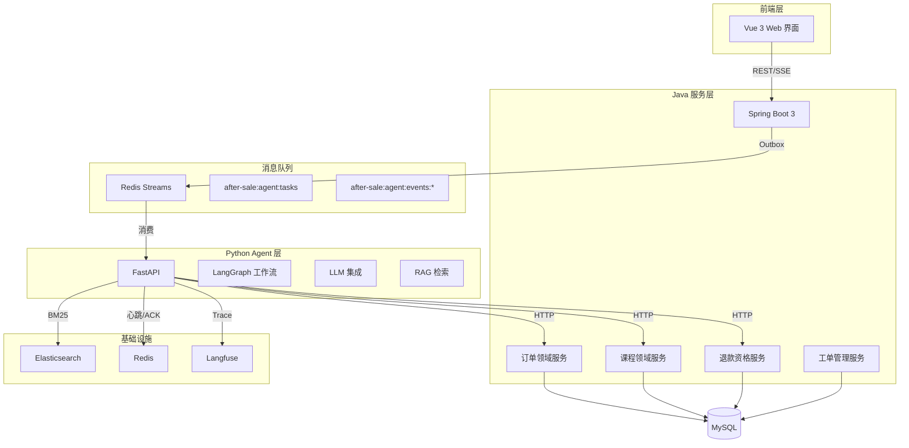
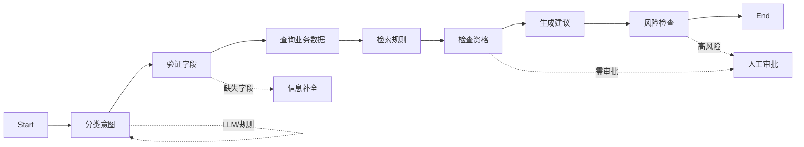
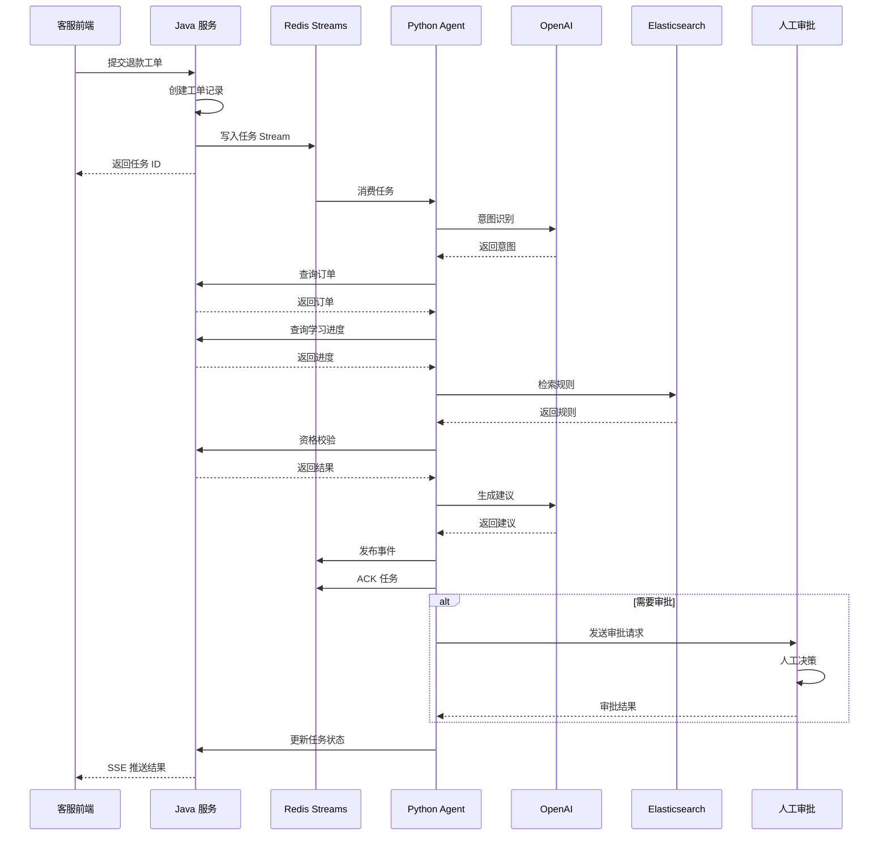
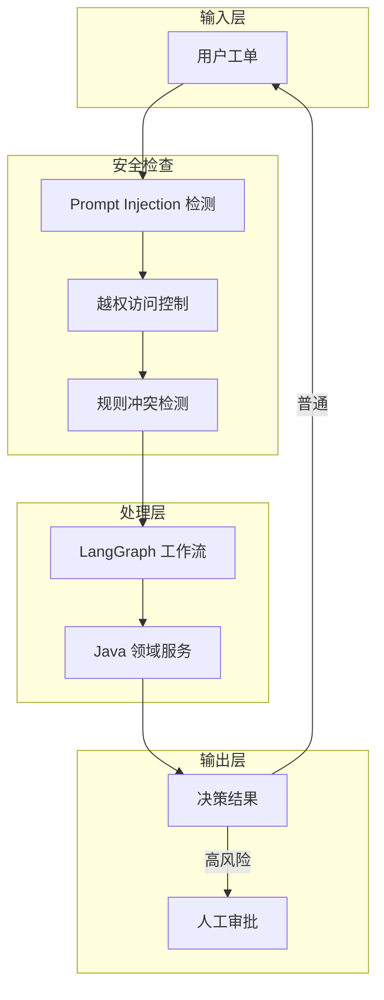
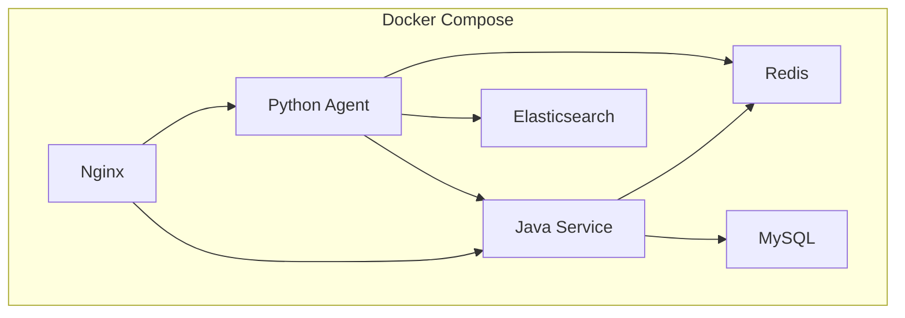

# 系统架构文档

## 整体架构

## LangGraph 工作流架构

## 数据流架构

## 安全架构

## 部署架构

## 技术选型理由

| 组件 | 选型 | 理由 |
|------|------|------|
| Java 框架 | Spring Boot 3 | 强一致业务、事务、权限 |
| Python 框架 | FastAPI + LangGraph | 模型 SDK、RAG、评测生态 |
| 消息队列 | Redis Streams | 轻量、at-least-once、消费组 |
| 检索引擎 | Elasticsearch | BM25、元数据过滤、混合检索 |
| 可观测性 | Langfuse | Trace、Token 记录、成本分析 |
| 数据库 | MySQL 8 | 业务数据持久化 |

## 扩展性设计

- **LLM 可替换**: 通过 Port 接口抽象，可切换不同模型
- **检索可升级**: BM25 基线，可平滑升级到 Hybrid Search
- **任务可恢复**: Redis Streams 消费组 + XPENDING 恢复
- **规则可更新**: ES 索引支持规则版本管理
